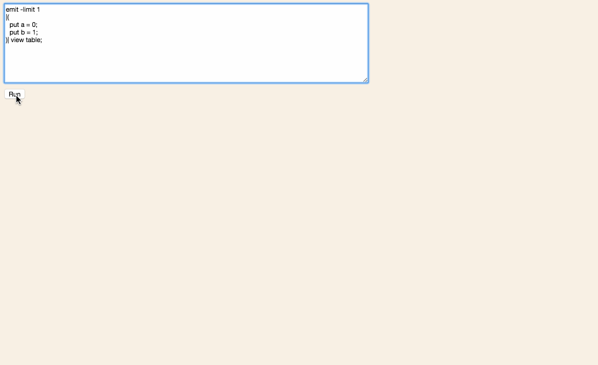

# Juttle Flowgraph Visualizer

**Note: This is a proof of concept.**

A [Juttle](https://github.com/juttle/juttle) [flowgraph](http://juttle.github.io/juttle/concepts/dataflow/) visualizer that produces a DAG visualization of a running juttle program.



## Getting Started

Make sure you have [nodejs](https://nodejs.org/en/) and [gulp](http://gulpjs.com/) installed.

```
$ git clone https://github.com/juttle/juttle-flowgraph-viz.git
$ npm install
$ gulp run
```
Go to `http://localhost:8888`.

Enter a juttle program that uses the [`emit`](http://juttle.github.io/juttle/sources/emit/) or [`read stochastic`](http://juttle.github.io/juttle/adapters/stochastic/) source and press play. Here is the example from the screencapture above:

```
emit -limit 1
|(
  put a = 0;
  put b = 1;
)| view table;
```
A visual representation of the flowgraph will appear. Each node shows the points going in and coming out. Once the program completes, a DVR-like slider appears allowing you to go back and see how points made their way through the flowgraph one step at a time.
